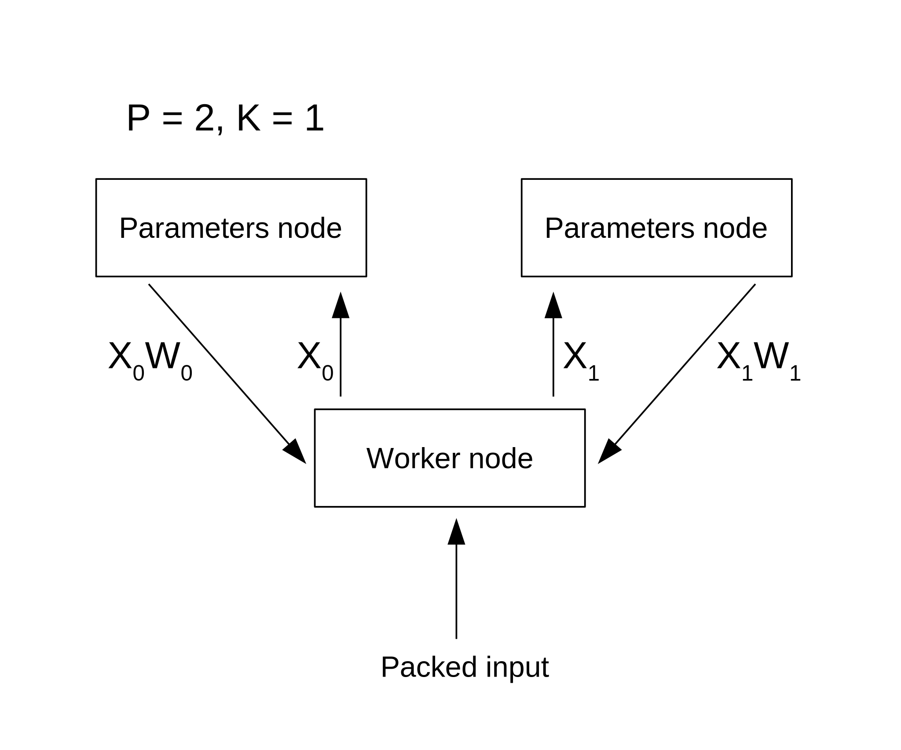

# ML training

Machine learning involves many matrix operations and is naturally parallelized not only within single node but also over distributed nodes. Out-of-box solutions like [Distributed training with TensorFlow](https://www.tensorflow.org/guide/distributed_training) transfer parameters (aka weights) from parameters nodes to worker nodes and back during model training. But large parameters matrices for sparse data heavily consume network bandwith and severely decrease model training speed[^twitter].

Sparse data means having many null values. For example, *unpacked* data batch `X` looks like
```ignore
[[0, 0, .., 0, 9], 
 [5,0, .., 0, 34], 
 ...
 [0, .., 720, 14]]
``` 
where total number of rows is a batch size `m` and each features row is about 2^20 values (yes, it's a Twitter's scale).

So the first layer of the network requires 2^20 rows in its parameters matrix `W` consisting of `float32` numbers (4 bytes each) and it's number of columns depends on the next layer size, typically 50 - 400 in case of Twitter. So this results in first layer matrices of 
`50 * 2^20  * (4*2^-20) Mb = 200 Mb` to `400 * 2^20  * (4*2^-20) Mb = 1600 Mb`. When you have a lot of worker nodes exhanging gigabyte of data each with parameters servers, your network bandwith is in danger. While first layer is huge, other layers are considerably smaller.

Twitter approaches this scalability problem with a clever nodes organization[^approach].

Assume we have `K` worker nodes, `P` parameters nodes, and `n` features in a dataset row.
Then if we break the weights matrix of the first (sparse) layer in `P` submatrices by features (by columns):

`X * W` = `X`<sub>1</sub>` * W`<sub>1</sub> + .. + `X`<sub>P</sub>` * W`<sub>P</sub>

then each worker node should only work with block of input `X`<sub>i</sub> and block of weights matrix `W`<sub>i</sub>.
Each parameters server `i` is responsible for i<sup>th</sup> partition `W`<sub>i</sub> of the sparse first layer.

Each worker node runs two processes with the following pseudocode:

Data unpacking and partitioning:

```ignore
const m // batch size
const P // number of partitions of the sparse layer

fn process_input() {
    loop {
        batch = receive_input_batch(m) // batch of size m
        for i in 0..P {
            submatrix = unpack_submatrix_i_of_features(batch, i) // with m rows and n/P columns
            send_this_submatrix_to_parameters_server(submatrix, i) // send to server i
        }
    }
}
```

Reconstructing output layer of the first sparse layer and training rest layers:

```ignore
const P // number of partitions of the sparse layer

fn train_rest_of_layers() {
    loop {
        output_layer // product XW of size m rows (batch size) and n columns (number of features)
        for i in 0..P {
            output_layer += receive_output_submatrix_from_parameters_server(i) // product of block of X and block of W from parameters server i
        }
        calculate_other_layers_of_network(output_layer)
    }
}
```
Because the second and further layers are much smaller than the first "sparse" layer, each worker node has these layers locally.

Each parameters node `i` runs the following process:

```ignore
const node_number = i
const K // number of workers

fn train_first_layer() {
    loop {
        Wi // block i of weights matrix for the first sparse layer
        Xi = receive_submatrix_of_features(i)
        block_i = calculate_block_product(Xi, Wi)
        for j in 0..K {
            send_output_layer_block_to_worker(block_i, j) // send to worker j
        }
    }
}
```



Such a cluster organization allows for failure and restart of a worker node without loss of weights of the first layer (failure of a parameters node is more damaging). Each worker node is stateless and no transfer of a huge sparse matrix `W` occurs over network[^results].

[^twitter]: [Distributed training of sparse ML models — Part 1: Network bottlenecks](https://blog.twitter.com/engineering/en_us/topics/insights/2020/distributed-training-of-sparse-machine-learning-models-1)

[^approach]: [Distributed training of sparse ML models — Part 2: Optimized strategies](https://blog.twitter.com/engineering/en_us/topics/insights/2020/distributed-training-of-sparse-machine-learning-models-2)

[^results]: [Distributed training of sparse ML models — Part 3: Observed speedups](https://blog.twitter.com/engineering/en_us/topics/insights/2020/distributed-training-of-sparse-machine-learning-models-3)