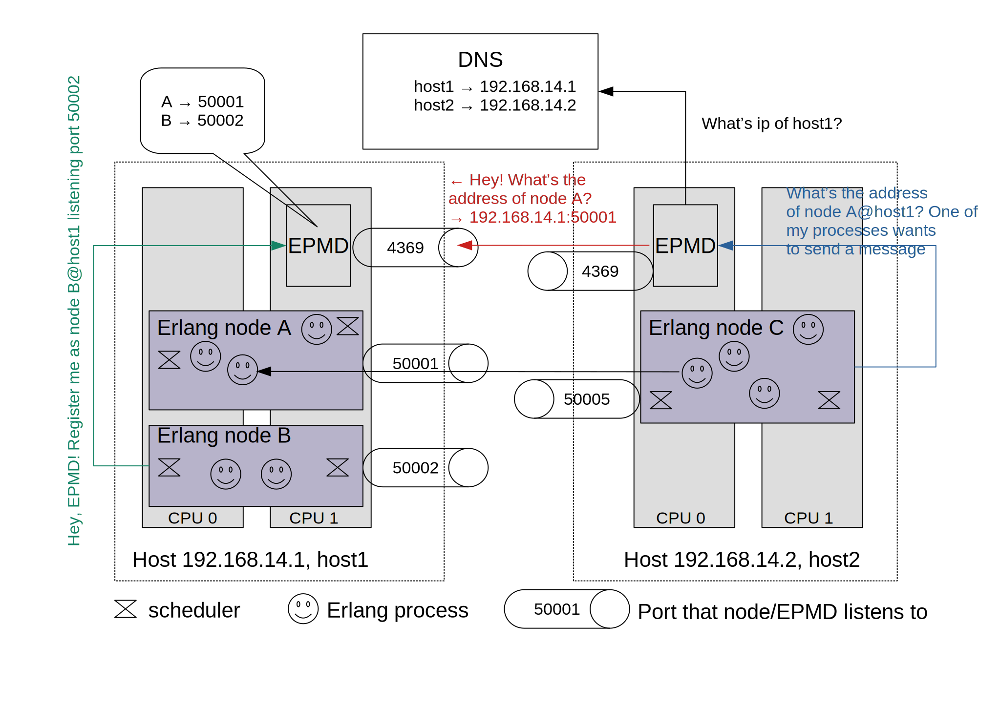

# Battle-tested Erlang/OTP

> *Any sufficiently complicated concurrent program in another language contains an ad hoc informally-specified bug-ridden slow implementation of half of Erlang.*
[Robert Virding](https://rvirding.blogspot.com/2008/01/virdings-first-rule-of-programming.html), one of the creators of Erlang

[Erlang](https://www.erlang.org) still remains to be a unique fusion of practical engineering and clever architectural vision. Created in 1980s, it still has such a great potential to evolve in a modern web[^klarna][^my_experience].

We won't dive in the language per se and pragmatic ideas of "let it fail", [supervision trees](https://adoptingerlang.org/docs/development/supervision_trees/), and fault tolerance. You can read very consice and full of practical wisdom [thesis](https://erlang.org/download/armstrong_thesis_2003.pdf) (highly recommended) of Joe Armstrong, one of the Erlang creators.

Let's focus more on Erlang distribution capabilities. Erlang is compiled to run in a virtual machine called BEAM[^lumen]. [Elixir](https://elixir-lang.org/) is also a BEAM-runnable language with interoperability with Erlang.

Erlang lightweight processes, while executing application logic, communicate with each other using signals. Most used signal type is a message[^actor]. Processes are scheduled for execution by BEAM. You can run millions of processes[^erlang_limits]. OTP is a collection of reusable components (abstractions for concurrent and distributed patterns such as client-server). So Erlang/OTP is a framework allowing you to quickly create complex concurrent and distributed systems.

BEAM (written in C) can be extended with dynamically loaded compiled modules with Native Implemented Functions ([NIFs](https://www.erlang.org/doc/tutorial/nif.html)). So you can write this shared module in a language you prefer (supporting C ABI, of course)[^rustler].  
Erlang is primarily well suited for a massive IO-bound load so for CPU-bound tasks you should use, for example, above mentioned NIFs[^erlang_io_bound].

Every node (Erlang VM) to form a cluster should share the same cookie file with a secret. It is rather a basic "security" with the aim to differentiate two or more clusters.
Every Erlang VM is started with a predefined name and then it's enough to register the rest `n-1` nodes on the first node. All nodes sharing the same cookie will propagate connections to each other creating a fully connected mesh network. This default transitive connection propagation can be configured -- a node called *hidden node* without transitive connections can be used to create clusters with less connections[^erlang_distribution].

By default, communication between nodes of a cluster is done over TCP.  Separate daemon process (called EPMD - [Erlang Port Mapper Daemon](https://www.erlang.org/doc/man/epmd.html)) starts (if not already running) on every host machine with Erlang VMs. EPMD uses DNS to resolve node names to ip addresses and maps node names to ip+port (tcp socket). EPMD serves as a name resolver for nodes on the host machine.

You can also implement your own procedures for [nodes discovery](https://www.erlang.org/doc/apps/erts/alt_disco.html) and discovery under [container](https://contactchanaka.medium.com/erlang-cluster-peer-discovery-on-kubernetes-aa2ed15663f9) orchestrator.

Default Erlang distribution with cookies assumes trusted network so you should change default communication mechanism in case of untrusted network[^epmdless]. Moreover, large number of nodes with fully connected mesh communicating over large and uncontrolled network can be prohibitatively costly. This break point may range from 40 to 140 nodes[^erlang_nodes] depending on load and amount of global state required to sync over cluster (such as a process namespace). In such cases federated[^federated] clusters and partitioning of global state in separate groups of nodes inside a cluster is a way to go[^erlang_scale].

Erlang is actively modernized and continuosly developed. So it's a solid foundation for distributed system.

**Erlang lessons to go distributed**:
* separation of concerns and modularity - you can configure your communication transport, algorithm of node discovery, network topology;
* communication is asynchronous so no node has to wait any acknowledgement that its message was received by another one;
* message passing is location transparent (the code to send message to local Erlang process is the same as for sending to a process on another node in the cluster -- at a cost of more RAM and time to `memcpy` as every message is deeply copied);
* maintaining global data (namespace of lightweight processes in case of Erlang) and full connectivity severely limits scalability.

[^klarna]: For example, Sweden fintech Klarna uses Erlang as it's core platform handling 2 million transactions per day - look at their [job descriptions](https://jobs.lever.co/klarna?team=Engineering).

[^my_experience]: At one of my work places I almost convinced my CTO to write IO-bound service for proxying media streams and unary requests in Erlang. For two weeks I read everything on Erlang and finally presented a workable version which was deployed to production. It had worked under production for about 3 weeks till the CTO had a look at the code. He was rather afraid of completely non-imperative style of code and inability to scale his Erlang team (consisted of only me). So he gently asked me to rewrite the app in Go. For those brave of you [Adopting Erlang](https://adoptingerlang.org/).

[^lumen]: Alternative execution environments (including not only VMs) emerge periodically but I haven't heard about any production-ready. BEAM is really [complicated](https://blog.stenmans.org/theBeamBook/) to reinvent. See also [Lumen](https://github.com/lumen/lumen).

[^actor]: A lot of holy wars around considering Erlang as an actor language. See [Stack Exchange question](https://softwareengineering.stackexchange.com/questions/277464/is-erlang-really-an-actor-model-language) and [Robert Virding's email](http://erlang.org/pipermail/erlang-questions/2014-June/079794.html).

[^erlang_limits]: See also [http://erlang.org/documentation/doc-5.8.4/doc/efficiency_guide/advanced.html](http://erlang.org/documentation/doc-5.8.4/doc/efficiency_guide/advanced.html)

[^rustler]: See [Rustler](https://github.com/rusterlium/rustler)

[^erlang_io_bound]: [Why we used Pony to write Wallaroo](https://news.ycombinator.com/item?id=15558051), 

[^erlang_distribution]: [Distributed Erlang](https://www.erlang.org/doc/reference_manual/distributed.html)

[^epmdless]: See also [epmdless](https://github.com/tsloughter/epmdless), [Using TLS for Erlang Distribution](https://www.erlang.org/doc/apps/ssl/ssl_distribution.html)

[^federated]: Federation is a technique to scale software by grouping its parts by feature. For example, you can federate database in separate servers: one for sessions, second for users, third for sales etc. Increased throughput comes with cost of joining data and holding transactions on the application side.

[^erlang_nodes]: [Scaling Reliably: Improving the Scalability of the Erlang Distributed Actor Platform](https://arxiv.org/pdf/1704.07234.pdf)

[^erlang_scale]: See [Scaling Reliably: Improving the Scalability of the Erlang Distributed Actor Platform](https://arxiv.org/pdf/1704.07234.pdf), [Scaling Erlang Cluster to 10,000 Nodes](https://www.infoq.com/presentations/erland-scale-10000-nodes/), [Stackoverflow question](https://stackoverflow.com/questions/5044574/how-scalable-is-distributed-erlang)
